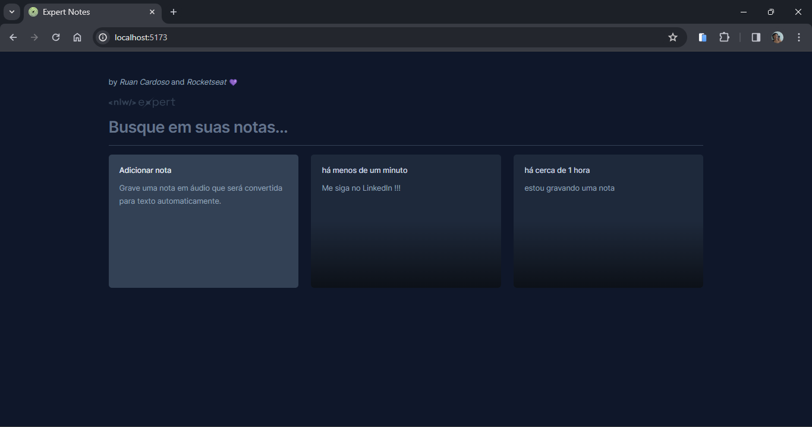

# Next Level Week - Expert Notes 📚

# Notas 💭

> ## Descrição 📚
Um projeto de geração de notas ministrado pela RocketSeat, desenvolvido com React e Vite, é uma aplicação simples e prática que permite aos usuários criar, visualizar e excluir notas de forma eficiente. Os usuários podem adicionar notas manualmente inserindo texto ou usar a transcrição de áudio para criar notas por meio da fala. Com uma interface amigável e responsiva, essa aplicação oferece uma maneira fácil e organizada de gerenciar informações importantes do dia a dia.

 
 

> ## Tecnologias 👨🏾‍💻
Foram utilizadas as seguintes tecnologias neste projeto:
+ React.Js + TypeScript :
  -  Lib Js para desenvolvimento de interfaces modernas baseadas em componentes.
+ Vite.Js:
  - Ambiente de desenvolvimento.
+ Tailwind CSS:
  - Principal estilizador baseado em classes.
+ Radix UI:
  - Lib de componentes React (modal).
+ Sonner:
  - Lib de componentes React (toast).
+ date-fns:
  - Lib de manipulação e gerenciamento de datas.
+ Lucide React:
  - Lib de icons.

 
 

> ## Printscreen do Projeto 📸

 
 

> ## Autor 📝
+ [Ruan Cardoso](https://www.linkedin.com/in/ruancardosolinkdin/)
